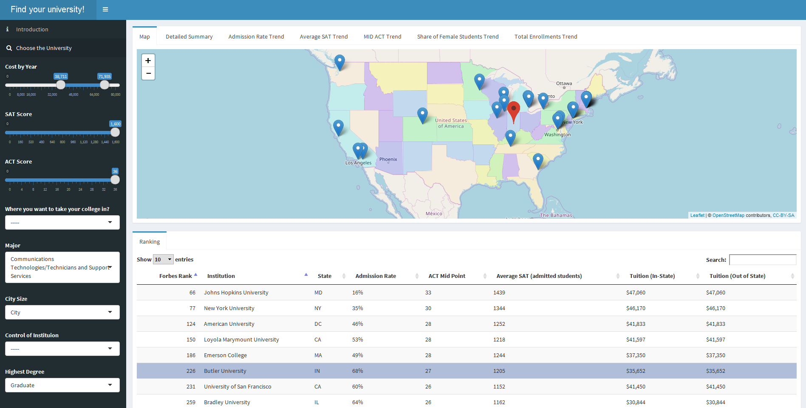

# Project 2: Open Data App - an RShiny app development project

## Project Title: Find your university
Term: Fall 2017

+ Team # group 9
+ **Projec title**: + Team members
	+ Henrique Saboya
	+ Peilin Qiu
	+ Qihang Li
	+ Yi Zhang
	+ Sijian Xuan

+ **Project summary**: The project is an Rshiny app used for choosing proper universities for perspective college students. It uses the data from Higher Education Datasets from www.data.gov. Group members cleaned and analyzed the data, and created a filter-based choosing system. The application reacts to users' preferences immediately. Users can also click on different university to see detailed information including.... 

+ **Link:https://xuansijian.shinyapps.io/pro2grp9/**

+ **Outlook**



+ **Contribution statement**: ([default](doc/a_note_on_contributions.md)) All team members contributed equally in all stages of this project. All team members approve our work presented in this GitHub repository including this contributions statement. 

Following [suggestions](http://nicercode.github.io/blog/2013-04-05-projects/) by [RICH FITZJOHN](http://nicercode.github.io/about/#Team) (@richfitz). This folder is orgarnized as follows.

```
proj/
├── app/
├── lib/
├── data/
└── doc/
```

Please see each subfolder for a README file.

